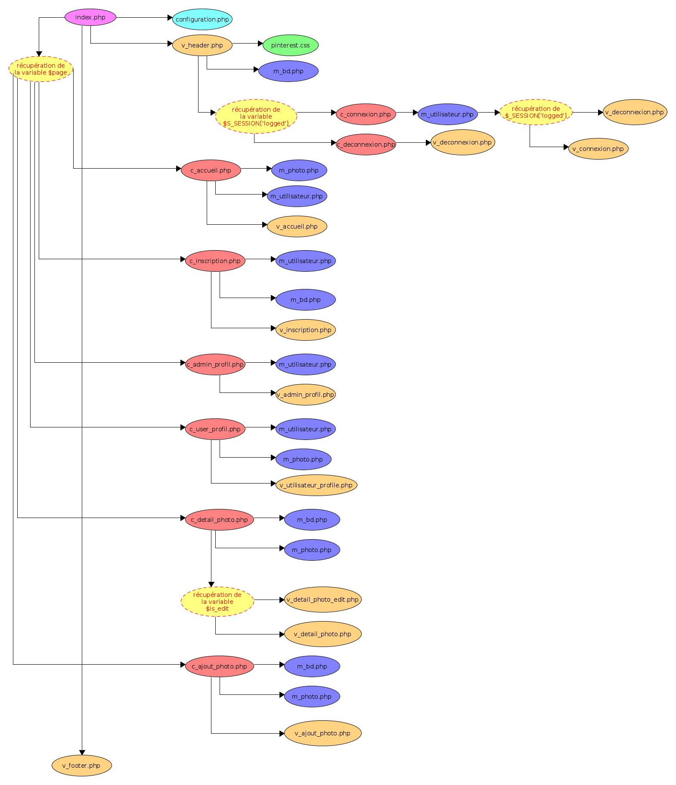
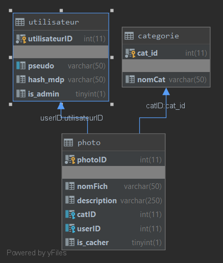

# miniPinterest-BDW1
## Details
### Auteurs
- p1810160 - ROSSI Joris
- p1910892 - JOLY Amaury
### Oganisation
[Université Claude Bernard Lyon 1](https://www.univ-lyon1.fr/) - 
[Licence Informatique](http://licence-info.univ-lyon1.fr/) - BDW1.
## Architectures
### Architecture du projet
Le projet est basé sur une architecture type MVC.
```markdown
miniPinterest-BDW1
├───assets `Contient les ressources`
│   └───image `Contients les images du pinterest`
├───bdd `Contient le fichier sql permettant l'importation de la bdd`
├───config `Contient le fichier de configuration du serveur`
├───controlers `Contient les controllers du serveur`
├───css `Contient les fichiers CSSs du serveur`
├───models `Contient les models du serveur`
└───views `Contient les vues du serveur`
```

#### Légende
- les vues en __orange__
- les controlers en __rouge__
- les modeles en __bleu__
- la configuration en __cyan__
- le CSS en __vert__
- L'index en __violet__
### Architecture de la base de donnée 

## Installation
- Importez le projet git a la racine de votre serveur web. (e.g. : 
`C:/xampp/htdocs/'NomDuSite'/`) grace à la commande 
`git clone https://forge.univ-lyon1.fr/bdw1/minipinterest-bdw1.git /'NomDuSite'/`
réalisée dans le dossier `C:/xampp/htdocs/`.
- Entrez dans le dossier crée avec `cd /'NomDuSite'/`
- Accordez les droits au dossier assets de manière a ce que les images puissent
êtres modifiés par le serveur web avec 
`find /assets/ -type d -exec chmod 755 {} \;`
- Importer le fichier `/bdd/bdd.sql` dans votre base de donnée
- Modifier le fichier `/config/configuration.php/` tel que :
    - `const BD_HOST = '`Adresse de votre base de donnée`';`
    - `const BD_DBNAME = '`Le nom de votre base de donnée`';`
    - `const BD_USER = '`Votre nom d'utilisateur`';`
    - `const BD_PWD = '`Votre mot de passe`';`
### Utilisation
Le serveur est fournit avec une base de donnée comprenant plusiseurs utilisateurs
- pseudo : `admin` pass : `admin` droit : `admin`
- pseudo : `Remy` pass : `pass` droit : `user`
- pseudo : `Paul` pass : `123456789` droit : `user`

Ainsi que plusieurs photos incluses dans le dossier `assets/image/`.
## Ressources
### Git/Forge
Nous utilisons un depot git pour notre projet. Stocker sur 
[la forge](https://forge.univ-lyon1.fr/), il nous permet un travail 
collaboratif et ordonné indispensable pour une réalisation en différée et a distance.

Nous utilisons tous les deux des terminaux git différents. Respectivement :
- [Sublime Merge](https://www.sublimemerge.com/)
- [GIT CMD](https://git-scm.com/)
### IDE
Nous avons aussi des environement de développements différents pour ce projet :
- [PHP Storm](https://www.jetbrains.com/fr-fr/phpstorm/) de Jet Brains
- [VS Code](https://code.visualstudio.com/) de Microsoft
### Serveurs local
Pour tester notre serveur en local nous avons utilisé un serveur Apache et MySQL
via [XAMPP](https://www.apachefriends.org/fr/index.html).
### SFTP
Le déploiement du site sur le serveur est rélaisé via le client SFTP [FileZilla](https://filezilla-project.org/) ainsi que via le client SFTP intégré a l'IDE 
[PhpStorm](https://www.jetbrains.com/fr-fr/phpstorm/).